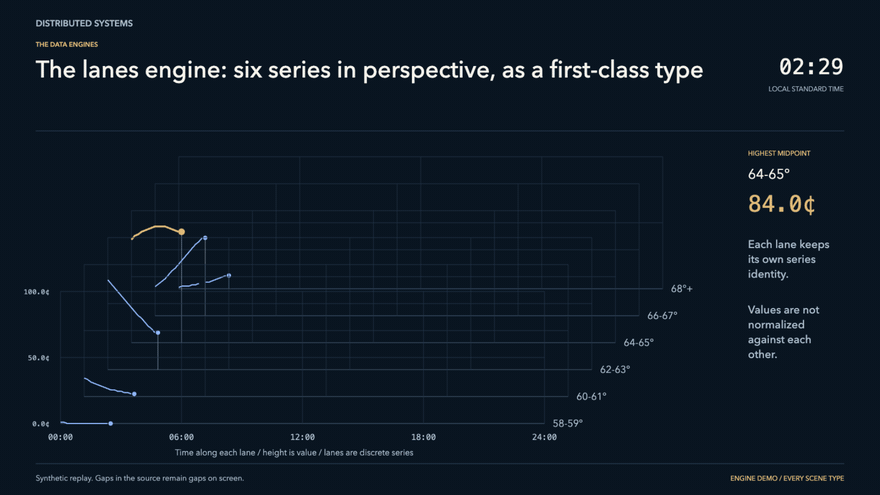
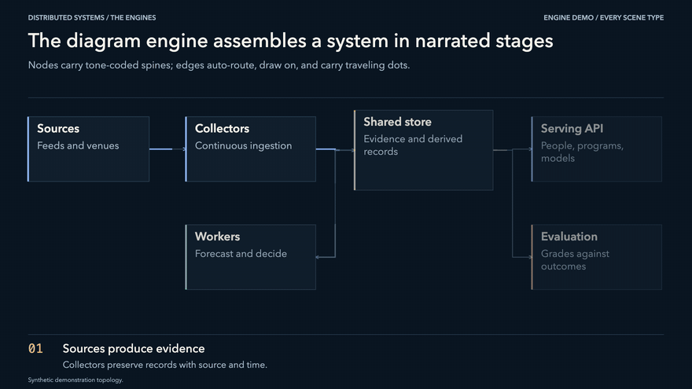
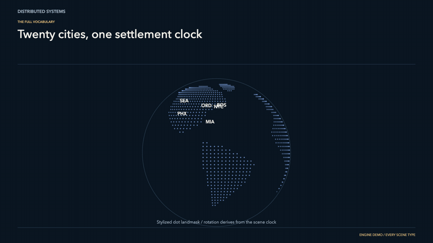
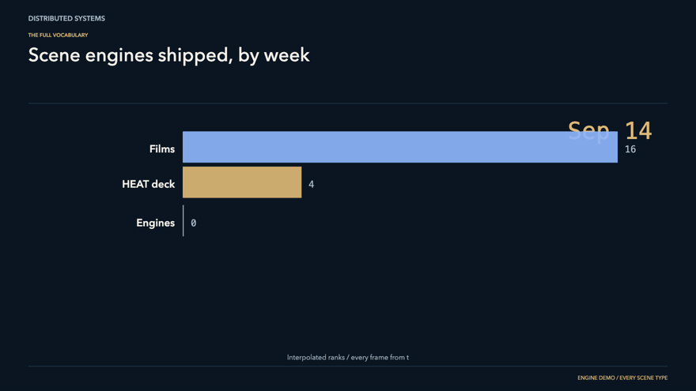
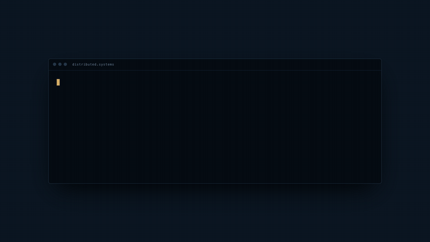

# Distributed-Slides

An MCP server that compiles talks into presentation software. Your agent writes scenes as JSON; the build emits **one offline folder** containing a private presenter desk (speaking notes, transition cues, rehearsal clock, live next-scene preview), a **synchronized audience window**, clicker hardening, and animation that behaves like an instrument, not a PowerPoint.

The whole system rests on one contract:

```js
mount(stage, scene, deck) -> { update(seconds, motionEnabled) }
```

Every animation is a pure function of the presenter clock. Nothing accumulates between frames. That is why scrubbing is exact, playback speed is free, the audience window is a frame-locked mirror rather than a guess, and `prefers-reduced-motion` renders a resolved final frame instead of a broken half-animation. The GIFs below were captured by scrubbing the clock — the same mechanism the audience sync uses.

<p>
  
  
</p>
<p>
  
  
</p>
<p>
  
</p>

## Quick start

Requires Node 18+. Zero dependencies — nothing to install, nothing phones home.

```sh
git clone https://github.com/arthurcolle/distributed-slides
cd distributed-slides

# run the bundled weather-trading example (50 scenes, every engine)
npm run demo
# → http://127.0.0.1:4620/   press P for the audience window, L for the scene index
```

Register the MCP server with your client:

```sh
claude mcp add distributed-slides -- node /path/to/distributed-slides/src/server.mjs
```

or in `.mcp.json`:

```json
{
  "mcpServers": {
    "distributed-slides": {
      "command": "node",
      "args": ["/path/to/distributed-slides/src/server.mjs"]
    }
  }
}
```

Then the workflow is: `create_deck` → read `scene_reference` → `add_scene` per scene → `set_route` → `build_deck` (or `preview_deck`). The build under `decks/<id>/dist/` is self-contained; open `index.html` from disk or any static host, forever, offline.

## The example: weather trading

`decks/demo-flagship/deck.json` is the committed example — a research-preview deck in the style of the HEAT weather-derivatives talk this engine was extracted from. Six Kalshi-style temperature buckets drawn as quote lanes in perspective, a phase-space trajectory of temperature × price × time, a ten-city matrix with independent local clocks, an order-lifecycle timeline, a settlement candle session, and the full catalog of every other engine. Missing quotes stay gaps on screen — the engine never interpolates over holes in the data.

Rebuild it from scratch (it is also the protocol test): `npm run smoke`.

## What the presenter gets

- **Private desk**: speaking notes, a "say this to transition" cue, delivery direction, a rehearsal clock, and a live miniature of the next scene frozen near its end state.
- **Audience window**: opened with one keypress, synchronized over `postMessage` with a per-session token. It never renders notes. Arrow keys pressed in either window keep both in step.
- **Run of show**: named routes (the 25-minute cut, the full route) switchable live; a searchable scene index with live thumbnails; deep links to any scene.
- **Clicker hardening**: one press is one scene — holding a button never races ahead; unknown remotes can be taught their Next/Back buttons in-app.
- **Blackout, share-screen mode, fullscreen**, and an original-slide toggle for imported decks.

## Scene engines

30 scene types, every one clock-driven:

| | |
|---|---|
| **Typography** | `hero` `statement` `quote` `bullets` `wordcloud` `code` `terminal` `countdown` |
| **People & proof** | `stats` `gallery` `wall` `people` |
| **Structure** | `diagram` `sequence` `tree` `network` `cycle` `venn` `pyramid` |
| **Data (canvas)** | `lanes` `trajectory` `matrix` `race` `globe` `dotmap` |
| **Media** | `film` `image` |
| **Free-form** | `elements` (choreographed 1280×720 objects with auto-routed connectors — PPTX-extraction-compatible) |
| **Escape hatch** | `custom` — scenes as code, SVG (full primitive kit + chrome) or raw canvas |

`chart` adds 21 declarative layouts: `bars` `series` `area` `timeline` `columns` `table` `cadence` `donut` `gauge` `scatter` `heatmap` `histogram` `waterfall` `slope` `funnel` `radar` `candles` `gantt` `bullet` `calendar` `bump`. No chart library — everything is drawn with the same primitive kit custom scenes get, so everything obeys the same clock.

Call the `scene_reference` tool for the full field-level spec of every type.

## MCP tools

`create_deck` `list_decks` `get_deck` `update_deck` `delete_deck` — deck lifecycle.
`add_scene` `update_scene` `remove_scene` `move_scene` — scenes, validated on entry (custom code is parse-checked before it is accepted).
`set_route` `set_data` `add_asset` — runs of show, real datasets (put observations in `deck.data`, not hardcoded into slides), art and film assets.
`validate_deck` `build_deck` `preview_deck` `stop_preview` `scene_reference` — checks, compilation, background preview server, self-documentation.

## Testing

```sh
npm run smoke          # drives the MCP over stdio end-to-end: builds the 50-scene example, checks validation rejects bad scenes
npm run test:browser   # real-Chrome click-through: every scene mounts, scrubs deterministically (canvas snapshot compare), audience window mirrors and never leaks notes
npm run gifs           # regenerates the README GIFs by scrubbing the clock
```

## Provenance

Extracted from the custom presentation system built for the HEAT research performance (Data Engineers DC, September 16, 2026) — 76 scenes, one folder, no network. The landing page in `site/` is rendered by the same `engine.js` it advertises.
